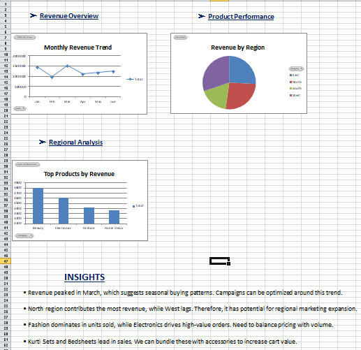

# E-commerce Sales Dashboard (Excel)

This project is a comprehensive sales dashboard created using **Microsoft Excel**, featuring pivot tables, slicers, and charts. It provides insights into sales performance across products, regions, and months.

---

- 📈 Monthly revenue trends  
- 🛍️ Top-performing product categories  
- 🌍 Regional sales performance  
- ⚠️ Underperforming segments

### 📊 Tools Used:
- Microsoft Excel
- Pivot Tables
- Charts
- Conditional Formatting

### 💡 Business Insights:
- Identified high-performing regions and products
- Revealed sales drop during specific months
- Suggested focus areas for improvement

---

📁 File: `Ecommerce_Sales_Dashboard.xlsx`  

## 👤 Author

**Shahaan Kaushik**  
B.Tech Computer Engineering
